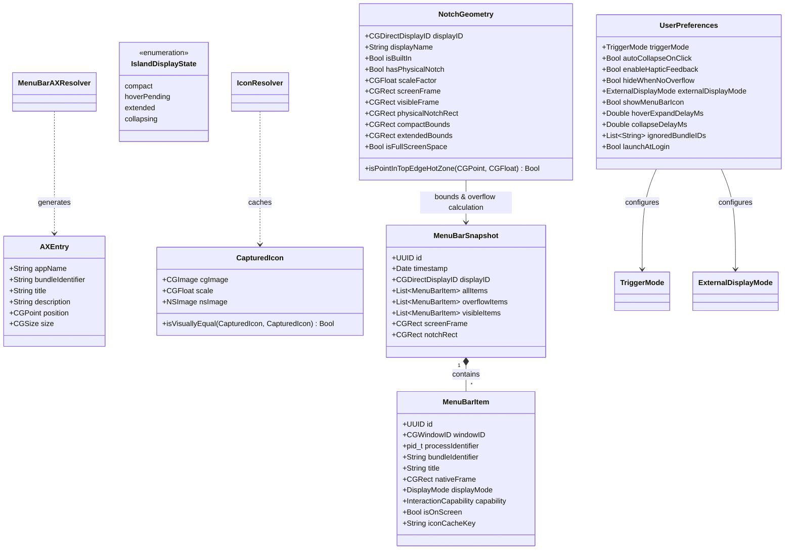
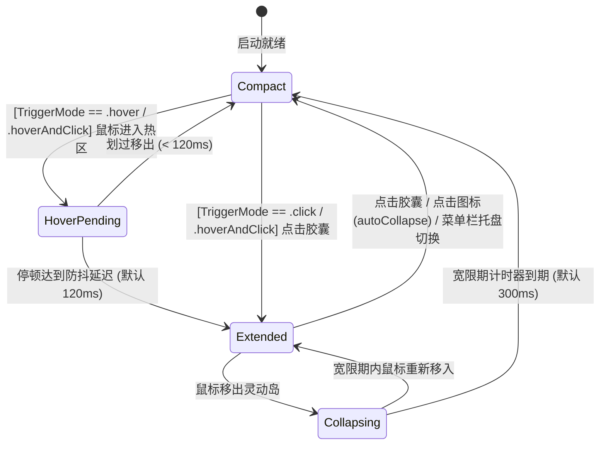

# NotchRail · 领域模型设计规范 (Domain Model Specification)

本文档定义 NotchRail 系统的核心领域模型、实体边界、值对象、配置体系、状态机生命周期与事件驱动机制。

---

## 1. 领域模型全景 (Domain Model Overview)



---

## 2. 核心实体与值对象 (Entities & Value Objects)

### 2.1 菜单栏项 (`MenuBarItem`)
表示扫描识别到的单一菜单栏窗口元素，以 `windowID: CGWindowID` 为底层物理主键。

```swift
public struct MenuBarItem: Identifiable, Equatable, Sendable {
    public let id: UUID
    public let windowID: CGWindowID
    public let processIdentifier: pid_t
    public let bundleIdentifier: String?
    public let title: String?
    public var nativeFrame: CGRect
    public var displayMode: DisplayMode
    public var capability: InteractionCapability
    public var isOnScreen: Bool
    
    /// 唯一且稳定的图标缓存键（基于 Bundle ID + 窗口 ID 或进程 ID）
    public var iconCacheKey: String {
        if let bundleID = bundleIdentifier, !bundleID.isEmpty {
            return "\(bundleID)_\(windowID)"
        }
        return "pid_\(processIdentifier)_win_\(windowID)"
    }
    
    public enum DisplayMode: String, Codable, Sendable {
        case nativeVisible   // 在原生菜单栏清晰可见
        case overflowed      // 因刘海遮挡或空间不足被挤出原生菜单栏
        case ignored         // 用户配置为在岛内隐藏
    }
    
    public enum InteractionCapability: String, Codable, Sendable {
        case standardAXPress // 支持通过 CGEvent + postToPid 触发原生下拉
    }
}
```

### 2.2 辅助功能空间条目 (`MenuBarAXResolver.Entry`)
表示扫描各运行应用提取出的菜单栏空间锚点，用于还原被宿主掩盖的三方应用身份。

```swift
public struct Entry: Sendable {
    public let appName: String
    public let bundleIdentifier: String?
    public let title: String?
    public let description: String?
    public let position: CGPoint
    public let size: CGSize
}
```

### 2.3 真实捕获图标 (`CapturedIcon`)
表示从 WindowServer 直接提取的带 scale 归一化的像素级真实帧缓冲位图。

```swift
public struct CapturedIcon: Sendable {
    public let cgImage: CGImage
    public let scale: CGFloat
    public var nsImage: NSImage
    
    /// 像素级视觉相等对比（动态数值跳动与静态图标分离）
    public static func isVisuallyEqual(_ lhs: CapturedIcon?, _ rhs: CapturedIcon?) -> Bool
}
```

### 2.4 用户偏好与交互配置 (`UserPreferences`)

```swift
public enum TriggerMode: String, Codable, CaseIterable, Sendable {
    case hover          // 鼠标悬停防抖触发（默认）
    case click          // 仅点击胶囊展开/收起
    case hoverAndClick  // 悬停或点击均可触发
}

public enum ExternalDisplayMode: String, Codable, CaseIterable, Sendable {
    case followFocusedScreen // 跟随当前聚焦屏幕（默认）
    case mainScreenOnly      // 仅在主显示器（刘海屏）显示
    case disabled            // 外接显示器完全禁用
}

public struct UserPreferences: Codable, Equatable, Sendable {
    public var triggerMode: TriggerMode
    public var autoCollapseOnClick: Bool
    public var enableHapticFeedback: Bool
    public var hideWhenNoOverflow: Bool
    public var externalDisplayMode: ExternalDisplayMode
    public var showMenuBarIcon: Bool
    public var hoverExpandDelayMs: Double
    public var collapseDelayMs: Double
    public var ignoredBundleIDs: [String]
    public var launchAtLogin: Bool
}
```

### 2.5 全屏空间状态检测器 (`FullScreenDetector`)
负责三层融合检测多屏异构全屏状态，事件驱动更新内存原子缓存池。

```swift
public final class FullScreenDetector {
    /// 缓存各显示器全屏状态 [CGDirectDisplayID: Bool]
    public private(set) var fullScreenStates: [CGDirectDisplayID: Bool]
    
    /// 刷新各显示器全屏状态（前台 App AX 属性 + WindowServer Layer-0 覆盖率）
    public func updateFullScreenStates() -> [CGDirectDisplayID: Bool]
}
```

---

## 3. 溢出计算与多屏几何规范 (`OverflowCalculator`)

```swift
public enum OverflowCalculator {
    public static let NOTCH_CORNER_SAFETY_MARGIN: CGFloat = 12.0
    public static let SCREEN_EDGE_TOLERANCE: CGFloat = 5.0
    
    /// 综合判定：底层 isOnScreen 标记 + 刘海圆角安全边界 + 屏幕左右边界溢出
    public static func resolve(
        items: [MenuBarItem],
        geometry: NotchGeometry,
        ignoredBundleIDs: Set<String> = []
    ) -> MenuBarSnapshot
}
```

---

## 4. 状态机驱动多通道触发 (`IslandStateMachine`)



---

## 5. 领域事件广播矩阵 (Domain Events)

| 事件名称 | 触发时机 | 负载数据 (Payload) | 主要监听者 |
| :--- | :--- | :--- | :--- |
| `MenuBarSnapshotUpdated` | 后台窗口扫描与几何计算完成 | `snapshot: MenuBarSnapshot` | `IslandRootView`, `StatusItemManager`, `SettingsView` |
| `IconStatesUpdated` | 动态像素比对发现网速/时钟/三方数值变化 | `iconStates: [String: IconState]` | `IslandIconCell`, `SettingsView` |
| `ActiveDisplayChanged` | 鼠标跨屏移动至新显示器 | `geometry: NotchGeometry` | `IslandWindowCoordinator`, `ScreenManager`, `MouseMonitor` |
| `NotchGeometryChanged` | 显示器插拔、分辨率变化或全屏空间切换 | `geometry: NotchGeometry` | `IslandWindowCoordinator`, `ScreenManager` |
| `FullScreenStateChanged` | 前台应用切换全屏或 Space 切换 | `isFullScreen: Bool` | `IslandWindowCoordinator`, `MouseMonitor` |
| `PreferencesChanged` | 用户设置（打开方式、外接屏模式、延迟、黑名单等）变动 | `preferences: UserPreferences` | `IslandStateMachine`, `IslandWindowCoordinator`, `StatusItemManager` |
| `PermissionStatusChanged` | 辅助功能或屏幕录制权限授予状态变化 | `isGranted: Bool` | `PermissionWindowCoordinator`, `SettingsView` |

