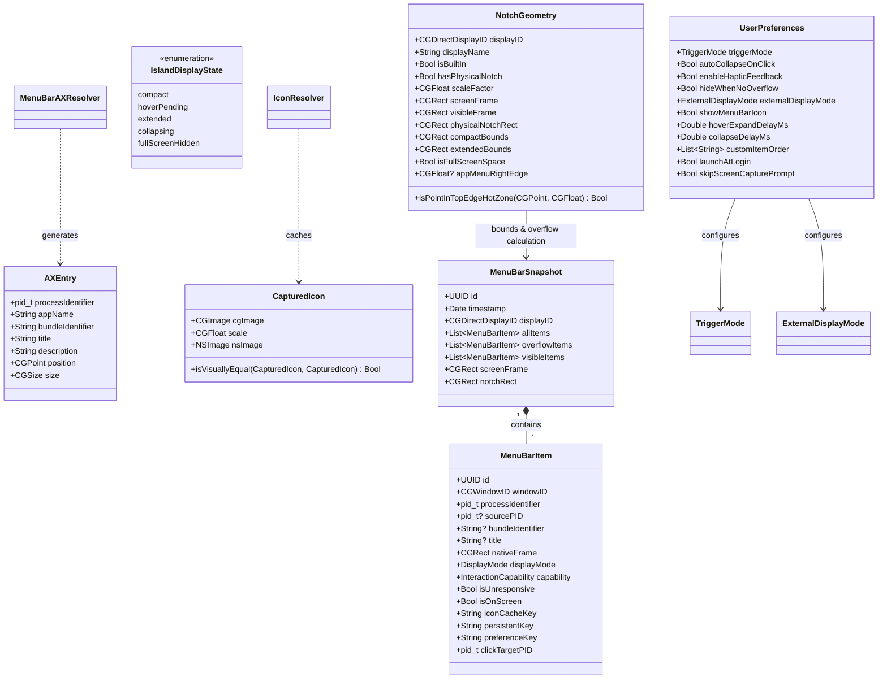
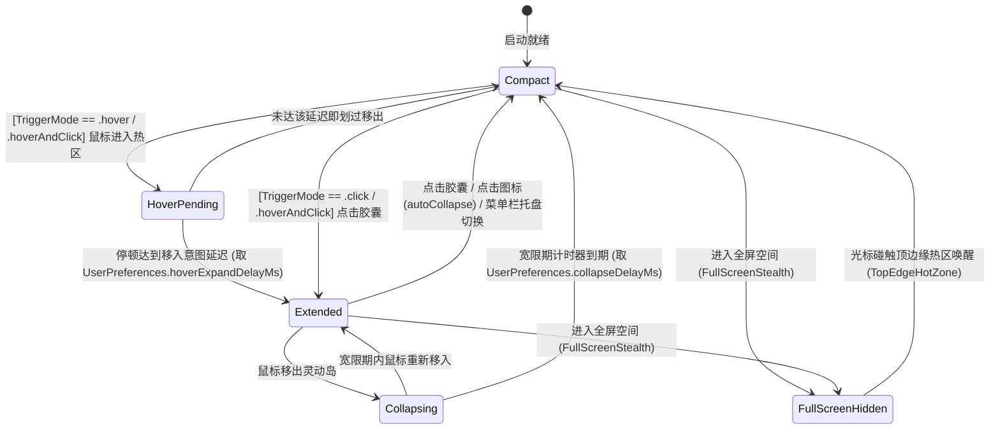

# NotchRail · 领域模型设计规范 (Domain Model Specification)

本文档定义 NotchRail 系统的核心领域模型、实体边界、值对象、配置体系、状态机生命周期与事件驱动机制。

> **权威边界**（见 `AGENTS.md` §0 归属矩阵）：本文件拥有**结构**的唯一解释权——实体、枚举、字段与签名。
> **术语含义**以 `CONTEXT.md` 为准，本文件不重定义；**数值**以代码中的具名常量声明为唯一来源，本文件只引常量名、不写数值；
> **决策理由**见 `docs/adr/`，本文件只引 ADR 编号、不复述决议。

---

## 1. 领域模型全景 (Domain Model Overview)



---

## 2. 核心实体与值对象 (Entities & Value Objects)

### 2.1 菜单栏项 (`MenuBarItem`)
表示扫描识别到的单一菜单栏窗口元素，以 `windowID: CGWindowID` 为底层物理主键。

```swift
public struct MenuBarItem: Identifiable, Equatable, Sendable {
    public let id: UUID
    public let windowID: CGWindowID
    /// 状态项窗口的 owner 进程（恒为控制中心宿主），**同时是事件派发的唯一正确目标**
    public let processIdentifier: pid_t
    /// 经 AX 空间配对解析出的真实归属应用 PID（仅供图元归属与 AX 元素定位，不参与点击派发；未配到时为 nil）
    public let sourcePID: pid_t?
    public let bundleIdentifier: String?
    public let title: String?
    public let axIdentifier: String?
    public let axRole: String?
    public let axSubrole: String?
    public var nativeFrame: CGRect
    public var displayMode: DisplayMode
    public var capability: InteractionCapability
    public var isUnresponsive: Bool
    public var isOnScreen: Bool
    
    /// 跨扫描周期的稳定持久化缓存键（优先 Bundle ID；缺失时依次回退 ax/title，最终以 windowID 严格物理隔离）
    public var persistentKey: String
    
    /// 图标缓存键（以 windowID 为主键，确保跨扫描周期与 AX 解析前后绝对稳定）
    public var iconCacheKey: String {
        if windowID != 0 {
            return "win_\(windowID)"
        } else {
            return "\(persistentKey)"
        }
    }
    
    /// 统一偏好与排序唯一标识键（优先 Bundle ID，回退持久化键）
    public var preferenceKey: String
    
    /// 事件派发的目标进程（**恒为窗口 owner**，即 `processIdentifier`；理由见 ADR 0010）
    public var clickTargetPID: pid_t
    
    public enum DisplayMode: String, Codable, Sendable {
        case nativeVisible   // 在原生菜单栏清晰可见
        case overflowed      // 因刘海遮挡或空间不足被挤出原生菜单栏
    }
    
    public enum InteractionCapability: String, Codable, Sendable {
        case standardAXPress // 支持标准 AXPress 触发原生下拉
        case unsupported     // 不支持直接 AX 触发
    }
}
```

### 2.2 辅助功能空间条目 (`MenuBarAXResolver.Entry`)
表示扫描各运行应用提取出的菜单栏空间锚点，用于还原被宿主掩盖的三方应用身份。

```swift
public struct Entry: Sendable {
    /// 持有该 AXExtrasMenuBar 的应用本身 PID —— 事件派发的正确目标来源
    public let processIdentifier: pid_t
    public let appName: String
    public let bundleIdentifier: String?
    public let title: String?
    public let description: String?
    public let position: CGPoint
    public let size: CGSize
}
```

### 2.3 真实捕获图标 (`CapturedIcon`)
表示从 WindowServer 直接提取的带 scale 归一化的像素级真实帧缓冲位图。

```swift
public struct CapturedIcon: Sendable {
    public let cgImage: CGImage
    public let scale: CGFloat
    public var nsImage: NSImage
    
    /// 像素级视觉相等对比（动态数值跳动与静态图标分离）
    public static func isVisuallyEqual(_ lhs: CapturedIcon?, _ rhs: CapturedIcon?) -> Bool
}
```

### 2.4 用户偏好与交互配置 (`UserPreferences`)

```swift
public enum TriggerMode: String, Codable, CaseIterable, Sendable {
    case hover          // 鼠标悬停防抖触发
    case click          // 仅点击胶囊展开/收起
    case hoverAndClick  // 悬停或点击均可触发
}

public enum ExternalDisplayMode: String, Codable, CaseIterable, Sendable {
    case followFocusedScreen // 跟随当前聚焦屏幕
    case mainScreenOnly      // 仅在主显示器（刘海屏）显示
    case disabled            // 外接显示器完全禁用
}

public struct UserPreferences: Codable, Equatable, Sendable {
    public var triggerMode: TriggerMode                 // 默认 .hoverAndClick
    public var autoCollapseOnClick: Bool                // 默认 true
    public var enableHapticFeedback: Bool               // 默认 true
    public var hideWhenNoOverflow: Bool                 // 默认 false
    public var externalDisplayMode: ExternalDisplayMode // 默认 .followFocusedScreen
    public var showMenuBarIcon: Bool                    // 默认 true
    public var hoverExpandDelayMs: Double               // 默认取 IslandTheme.Timing.HOVER_EXPAND_DELAY
    public var collapseDelayMs: Double                  // 默认取 IslandTheme.Timing.COLLAPSE_DELAY
    public var customItemOrder: [String]                // 默认 []
    public var launchAtLogin: Bool                      // 默认 false
    public var skipScreenCapturePrompt: Bool            // 默认 false
}
```

### 2.5 全屏空间状态检测器 (`FullScreenDetector`)
负责三层融合检测多屏异构全屏状态，事件驱动更新内存原子缓存池。

```swift
public final class FullScreenDetector {
    /// 缓存各显示器全屏状态 [CGDirectDisplayID: Bool]
    public private(set) var fullScreenStates: [CGDirectDisplayID: Bool]
    
    /// 刷新各显示器全屏状态（前台 App AX 属性 + WindowServer Layer-0 覆盖率）
    public func updateFullScreenStates() -> [CGDirectDisplayID: Bool]
}
```

### 2.6 屏幕几何与刘海/菜单碰撞契约 (`NotchGeometry`)
表示单一显示器的物理测绘几何参数与状态栏环境，是双轨溢出判定与视口布局的核心值对象。

```swift
public struct NotchGeometry: Equatable, Sendable, Identifiable {
    public let displayID: CGDirectDisplayID
    public let displayName: String
    public let isBuiltIn: Bool
    public let hasPhysicalNotch: Bool
    public let scaleFactor: CGFloat
    public let screenFrame: CGRect
    public let visibleFrame: CGRect
    public let safeAreaInsets: NSEdgeInsets
    public let physicalNotchRect: CGRect
    public let compactBounds: CGRect
    public let extendedBounds: CGRect
    public let statusBarHeight: CGFloat
    public let isFullScreenSpace: Bool
    public let appMenuRightEdge: CGFloat?
    
    /// 初始化几何参数（平直屏 appMenuRightEdge 初始默认为 nil）
    public init(...)
}
```

本类型同时定义热区与兜底阈值常量（**数值以代码为准**）：顶边缘热区阈值 `TOP_EDGE_HOT_ZONE_THRESHOLD`、外接屏中央热区跨度 `EXTERNAL_CENTER_HOT_ZONE_SPAN` 与垂直阈值 `EXTERNAL_CENTER_HOT_ZONE_THRESHOLD`、状态栏高度兜底 `DEFAULT_STATUS_BAR_HEIGHT`、系统默认应用菜单保留宽度 `DEFAULT_APP_MENU_WIDTH`。

- **物理刘海屏 (`hasPhysicalNotch == true`)**：
  - `physicalNotchRect`：严格取自硬件刘海物理矩形；
  - `compactBounds`：常驻紧凑胶囊，以物理刘海为锚点，左侧根据溢出项动态伸出耳翼；
  - `appMenuRightEdge`：设为 `nil`（物理刘海屏溢出完全基于物理刘海右侧过渡区安全余量判定）。
- **平直外接屏 (`hasPhysicalNotch == false`)**：
  - `physicalNotchRect`：严格归零（`.zero`）——虚拟假刘海形态已被彻底废除，该项不变量与废除理由见 `AGENTS.md` §3.1，本文不复述；
  - `compactBounds`：常态归零（`.zero`），面板 100% 隐形（`alpha = 0`，`ignoresMouseEvents = true`）；
  - `appMenuRightEdge`：动态捕获前台活跃应用主菜单的右边缘 X 坐标，作为状态项挤压碰撞阈值；
  - **展开形态（统一黑仿真灵动岛）**：彻底废除平直托轨（flat-docked shelf）形态。外接平直屏展开形态与刘海屏灵动岛**视觉完全统一**，均保留 `IslandTheme.CornerRadius.TOP_EAR` 经典外展喇叭弧、纯黑吸光底座与微光渐变描边；
  - **视口架构（聚焦流转架构 Focus Following Architecture）**：彻底废除“视口借调（Viewport Leasing）”概念与术语。每块屏的视口只属于该屏（按 `displayID` 注册，见 `AGENTS.md` §2.1），折叠常态外接屏处于 `externalStealth`（100% 隐形穿透），触碰顶部中央热区即时原位升起展开；屏幕焦点只决定用户正在与哪块屏交互，绝不迁移或借用视口。

### 2.7 点击派发契约 (`MenuBarItemClicker`)

岛内图标的点击语义只有两种，**刻意不含「左键双击」**（理由见 ADR 0010）：

```swift
public enum MenuBarClickKind: String, Sendable {
    case single      // 左键单击
    case secondary   // 辅助点击（触控板双指点击 = 鼠标右键，二者是同一个操作）
}

public enum ClickError: Error, Sendable {
    case invalidWindow      // 缺少有效 windowID（非窗口枚举路径）
    case frameUnavailable   // 无法获取窗口实时 frame
    case eventCreationFailed
    case noResponse         // 事件已送达该状态项，但目标应用在响应观察窗内无可见响应（非「不可达」）
}
```

派发目标恒为 `MenuBarItem.clickTargetPID`；两条投递通道（宿主激活 / 会话事件流 + 目标窗口字段）的通道边界、不予 `isOnScreen` 分流的原因与响应判定，见 [ADR 0010](adr/0010-status-item-owner-event-dispatch.md) 与 [ADR 0011](adr/0011-secondary-click-session-event-routing.md) 及 `AGENTS.md` §3.4，本文不复述。点击事件的字段组装以 `MenuBarClickEventFactory` 为唯一来源。

---

## 3. 溢出计算与多屏几何规范 (`OverflowCalculator`)

`OverflowCalculator` 负责将 WindowServer 枚举出的原始状态项划分为可见项（`visibleItems`）与溢出项（`overflowItems`），执行纯几何物理判定，坚决杜绝依赖 `!item.isOnScreen`：

```swift
public enum OverflowCalculator {
    /// 物理刘海右过渡区安全余量（数值以代码为准）
    public static let NOTCH_CORNER_SAFETY_MARGIN: CGFloat
    /// 平直屏前台 App 菜单碰撞安全余量（数值以代码为准）
    public static let APP_MENU_COLLISION_SAFETY_MARGIN: CGFloat
    /// 屏幕左右边界越界容忍度（数值以代码为准）
    public static let SCREEN_EDGE_TOLERANCE: CGFloat
    
    /// 双轨判定：物理刘海过渡区余量 / 平直屏 App 菜单边缘碰撞 + 屏幕左右边界越界
    public static func resolve(
        items: [MenuBarItem],
        geometry: NotchGeometry,
        customItemOrder: [String] = []
    ) -> MenuBarSnapshot
}
```

- **物理刘海屏双轨判定**：
  - `frame.minX < geometry.physicalNotchRect.maxX + NOTCH_CORNER_SAFETY_MARGIN`
- **平直外接屏双轨判定**：
  - 当 `geometry.hasPhysicalNotch == false` 时，若 `geometry.appMenuRightEdge` 存在，判定 `frame.minX < appMenuRightEdge + APP_MENU_COLLISION_SAFETY_MARGIN`；
- **通配屏幕越界判定**：
  - `frame.maxX > screenMaxX + SCREEN_EDGE_TOLERANCE` 或 `frame.maxX < screenMinX`。

---

## 4. 状态机驱动多通道触发 (`IslandStateMachine`)



---

## 5. 领域事件广播矩阵 (Domain Events)

| 事件名称 | 触发时机 | 负载数据 (Payload) | 主要监听者 |
| :--- | :--- | :--- | :--- |
| `MenuBarSnapshotUpdated` | 后台窗口扫描与几何计算完成 | `snapshot: MenuBarSnapshot` | `IslandRootView`, `StatusItemManager`, `SettingsView` |
| `IconStatesUpdated` | 动态像素比对发现网速/时钟/三方数值变化 | `iconStates: [String: IconState]` | `IslandIconCell`, `SettingsView` |
| `ActiveDisplayChanged` | 鼠标跨屏移动至新显示器 | `geometry: NotchGeometry` | `IslandWindowCoordinator`, `ScreenManager`, `MouseMonitor` |
| `NotchGeometryChanged` | 显示器插拔、分辨率变化或全屏空间切换 | `geometry: NotchGeometry` | `IslandWindowCoordinator`, `ScreenManager` |
| `FullScreenStateChanged` | 前台应用切换全屏或 Space 切换 | `isFullScreen: Bool` | `IslandWindowCoordinator`, `MouseMonitor` |
| `PreferencesChanged` | 用户设置（打开方式、外接屏模式、延迟、自定义排序等）变动 | `preferences: UserPreferences` | `IslandStateMachine`, `IslandWindowCoordinator`, `StatusItemManager` |
| `PermissionStatusChanged` | 辅助功能或屏幕录制权限授予状态变化 | `isGranted: Bool` | `PermissionWindowCoordinator`, `SettingsView` |

---

## 6. 架构决策记录矩阵 (ADR Mapping Matrix)

本领域模型规范与全局架构决策记录（Architecture Decision Records, ADR）严格对齐。

下表**仅为索引**（ADR 编号 ↔ 影响的本文件契约）；各决议的**理由与取舍**以 `docs/adr/` 正文为唯一来源，此处不复述。

| ADR 编号 | 决策主题 | 影响模型 / 契约 |
| :--- | :--- | :--- |
| **ADR 0001** | AX 空间几何反查映射 | `MenuBarAXResolver`, `AXEntry` |
| **ADR 0002** | 外接平直屏物理零刘海与动态菜单碰撞 | `NotchGeometry`, `OverflowCalculator`, `IslandPanel` |
| **ADR 0003** | 纯物理几何判定并废弃 isOnScreen | `OverflowCalculator`, `MenuBarItem` |
| **ADR 0004** | 零降级真实位图像素级镜像 | `CapturedIcon`, `IconResolver` |
| **ADR 0005** | 原生物理坐标合成事件精准分发（决议被 0010 取代） | `MenuBarItem`, `CGEvent` |
| **ADR 0006** | 稳固常驻视口与硬件级穿透管理 | `IslandWindowCoordinator`, `MouseMonitor` |
| **ADR 0007** | 全屏空间隐退与顶边缘极窄热区唤醒 | `FullScreenDetector`, `NotchGeometry` |
| **ADR 0008** | 双面板独立拓扑与聚焦流转架构（部分被 0009 取代） | `IslandWindowCoordinator`, `IconResolver`, `MenuBarSyncCoordinator` |
| **ADR 0009** | 多屏视口与状态机注册表 | `IslandWindowCoordinator`, `IslandHostingView`, `MenuBarItem.sourcePID` |
| **ADR 0010** | 状态项窗口 owner 派发与双通道点击策略（决议 3、6 被 0011 取代） | `MenuBarItem.clickTargetPID`, `MenuBarClickKind`, `MenuBarClickEventFactory` |
| **ADR 0011** | 辅助点击走会话事件流 + 目标窗口字段路由 | `MenuBarItemClicker`, `ClickError.noResponse`, `Bridging.popUpMenuWindowOwners` |

> 注：ADR 0002 的决议 3（视口借调）与平直托轨形态已被 **ADR 0008** 取代；ADR 0008 的决议 2 与决议 5 中「第三块及以上显示器无归属面板」的部分，已被 **ADR 0009** 取代；ADR 0005 的决议（单一 `postToPid` 通道）已被 **ADR 0010** 取代；ADR 0010 的决议 3、6（辅助点击按 `isOnScreen` 判定可达性、未合成项无通道、`ClickError.unreachableTarget`）已被 **ADR 0011** 取代，均详见对应 ADR 顶部的状态横幅。

