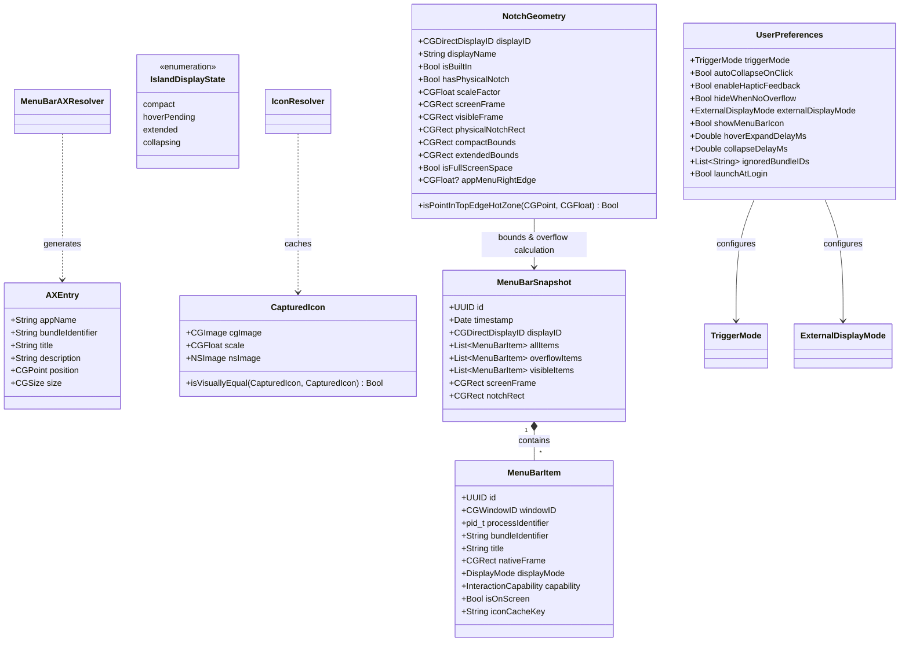
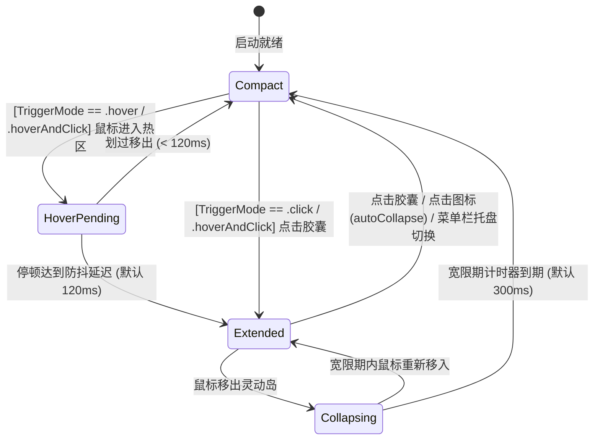

# NotchRail · 领域模型设计规范 (Domain Model Specification)

本文档定义 NotchRail 系统的核心领域模型、实体边界、值对象、配置体系、状态机生命周期与事件驱动机制。

---

## 1. 领域模型全景 (Domain Model Overview)



---

## 2. 核心实体与值对象 (Entities & Value Objects)

### 2.1 菜单栏项 (`MenuBarItem`)
表示扫描识别到的单一菜单栏窗口元素，以 `windowID: CGWindowID` 为底层物理主键。

```swift
public struct MenuBarItem: Identifiable, Equatable, Sendable {
    public let id: UUID
    public let windowID: CGWindowID
    public let processIdentifier: pid_t
    public let bundleIdentifier: String?
    public let title: String?
    public var nativeFrame: CGRect
    public var displayMode: DisplayMode
    public var capability: InteractionCapability
    public var isOnScreen: Bool
    
    /// 唯一且稳定的图标缓存键（基于 Bundle ID + 窗口 ID 或进程 ID）
    public var iconCacheKey: String {
        if let bundleID = bundleIdentifier, !bundleID.isEmpty {
            return "\(bundleID)_\(windowID)"
        }
        return "pid_\(processIdentifier)_win_\(windowID)"
    }
    
    public enum DisplayMode: String, Codable, Sendable {
        case nativeVisible   // 在原生菜单栏清晰可见
        case overflowed      // 因刘海遮挡或空间不足被挤出原生菜单栏
        case ignored         // 用户配置为在岛内隐藏
    }
    
    public enum InteractionCapability: String, Codable, Sendable {
        case standardAXPress // 支持通过 CGEvent + postToPid 触发原生下拉
    }
}
```

### 2.2 辅助功能空间条目 (`MenuBarAXResolver.Entry`)
表示扫描各运行应用提取出的菜单栏空间锚点，用于还原被宿主掩盖的三方应用身份。

```swift
public struct Entry: Sendable {
    public let appName: String
    public let bundleIdentifier: String?
    public let title: String?
    public let description: String?
    public let position: CGPoint
    public let size: CGSize
}
```

### 2.3 真实捕获图标 (`CapturedIcon`)
表示从 WindowServer 直接提取的带 scale 归一化的像素级真实帧缓冲位图。

```swift
public struct CapturedIcon: Sendable {
    public let cgImage: CGImage
    public let scale: CGFloat
    public var nsImage: NSImage
    
    /// 像素级视觉相等对比（动态数值跳动与静态图标分离）
    public static func isVisuallyEqual(_ lhs: CapturedIcon?, _ rhs: CapturedIcon?) -> Bool
}
```

### 2.4 用户偏好与交互配置 (`UserPreferences`)

```swift
public enum TriggerMode: String, Codable, CaseIterable, Sendable {
    case hover          // 鼠标悬停防抖触发（默认）
    case click          // 仅点击胶囊展开/收起
    case hoverAndClick  // 悬停或点击均可触发
}

public enum ExternalDisplayMode: String, Codable, CaseIterable, Sendable {
    case followFocusedScreen // 跟随当前聚焦屏幕（默认）
    case mainScreenOnly      // 仅在主显示器（刘海屏）显示
    case disabled            // 外接显示器完全禁用
}

public struct UserPreferences: Codable, Equatable, Sendable {
    public var triggerMode: TriggerMode
    public var autoCollapseOnClick: Bool
    public var enableHapticFeedback: Bool
    public var hideWhenNoOverflow: Bool
    public var externalDisplayMode: ExternalDisplayMode
    public var showMenuBarIcon: Bool
    public var hoverExpandDelayMs: Double
    public var collapseDelayMs: Double
    public var ignoredBundleIDs: [String]
    public var launchAtLogin: Bool
}
```

### 2.5 全屏空间状态检测器 (`FullScreenDetector`)
负责三层融合检测多屏异构全屏状态，事件驱动更新内存原子缓存池。

```swift
public final class FullScreenDetector {
    /// 缓存各显示器全屏状态 [CGDirectDisplayID: Bool]
    public private(set) var fullScreenStates: [CGDirectDisplayID: Bool]
    
    /// 刷新各显示器全屏状态（前台 App AX 属性 + WindowServer Layer-0 覆盖率）
    public func updateFullScreenStates() -> [CGDirectDisplayID: Bool]
}
```

### 2.6 屏幕几何与刘海/菜单碰撞契约 (`NotchGeometry`)
表示单一显示器的物理测绘几何参数与状态栏环境，是双轨溢出判定与视口布局的核心值对象。

```swift
public struct NotchGeometry: Equatable, Sendable, Identifiable {
    public let displayID: CGDirectDisplayID
    public let displayName: String
    public let isBuiltIn: Bool
    public let hasPhysicalNotch: Bool
    public let scaleFactor: CGFloat
    public let screenFrame: CGRect
    public let visibleFrame: CGRect
    public let safeAreaInsets: NSEdgeInsets
    public let physicalNotchRect: CGRect
    public let compactBounds: CGRect
    public let extendedBounds: CGRect
    public let statusBarHeight: CGFloat
    public let isFullScreenSpace: Bool
    public let appMenuRightEdge: CGFloat?
    
    /// 初始化几何参数（平直屏 appMenuRightEdge 初始默认为 nil）
    public init(...)
}
```

- **物理刘海屏 (`hasPhysicalNotch == true`)**：
  - `physicalNotchRect`：严格取自硬件刘海物理矩形；
  - `compactBounds`：常驻紧凑胶囊，以物理刘海为锚点，左侧根据溢出项动态伸出耳翼；
  - `appMenuRightEdge`：设为 `nil`（物理刘海屏溢出完全基于物理刘海右侧过渡区安全余量判定）。
- **平直外接屏 (`hasPhysicalNotch == false`)**：
  - `physicalNotchRect`：严格归零（`.zero`），废除假想 160pt 虚拟刘海；
  - `compactBounds`：常态归零（`.zero`），面板 100% 隐形（`alpha = 0`，`ignoresMouseEvents = true`）；
  - `appMenuRightEdge`：动态捕获前台活跃应用主菜单的右边缘 X 坐标，作为状态项挤压碰撞阈值；
  - 展开形态：吸顶平直悬浮托轨 `FloatingShelf`（`topEarRadius = 0.0`），视口采用借调（`ViewportLease`）机制。

---

## 3. 溢出计算与多屏几何规范 (`OverflowCalculator`)

`OverflowCalculator` 负责将 WindowServer 枚举出的原始状态项划分为可见项（`visibleItems`）与溢出项（`overflowItems`），执行纯几何物理判定，坚决杜绝依赖 `!item.isOnScreen`：

```swift
public enum OverflowCalculator {
    public static let NOTCH_CORNER_SAFETY_MARGIN: CGFloat = 24.0 // 物理刘海右过渡区余量
    public static let APP_MENU_COLLISION_MARGIN: CGFloat = 12.0  // 平直屏菜单碰撞安全余量
    public static let SCREEN_EDGE_TOLERANCE: CGFloat = 5.0
    
    /// 双轨判定：物理刘海过渡区余量 / 平直屏 App 菜单边缘碰撞 + 屏幕左右边界越界
    public static func resolve(
        items: [MenuBarItem],
        geometry: NotchGeometry,
        ignoredBundleIDs: Set<String> = []
    ) -> MenuBarSnapshot
}
```

- **物理刘海屏双轨判定**：
  - `frame.minX < geometry.physicalNotchRect.maxX + NOTCH_CORNER_SAFETY_MARGIN`
- **平直外接屏双轨判定**：
  - 当 `geometry.hasPhysicalNotch == false` 时，若 `geometry.appMenuRightEdge` 存在，判定 `frame.minX < appMenuRightEdge + APP_MENU_COLLISION_MARGIN`；
- **通配屏幕越界判定**：
  - `frame.maxX > screenMaxX + SCREEN_EDGE_TOLERANCE` 或 `frame.maxX < screenMinX`。

---

## 4. 状态机驱动多通道触发 (`IslandStateMachine`)



---

## 5. 领域事件广播矩阵 (Domain Events)

| 事件名称 | 触发时机 | 负载数据 (Payload) | 主要监听者 |
| :--- | :--- | :--- | :--- |
| `MenuBarSnapshotUpdated` | 后台窗口扫描与几何计算完成 | `snapshot: MenuBarSnapshot` | `IslandRootView`, `StatusItemManager`, `SettingsView` |
| `IconStatesUpdated` | 动态像素比对发现网速/时钟/三方数值变化 | `iconStates: [String: IconState]` | `IslandIconCell`, `SettingsView` |
| `ActiveDisplayChanged` | 鼠标跨屏移动至新显示器 | `geometry: NotchGeometry` | `IslandWindowCoordinator`, `ScreenManager`, `MouseMonitor` |
| `NotchGeometryChanged` | 显示器插拔、分辨率变化或全屏空间切换 | `geometry: NotchGeometry` | `IslandWindowCoordinator`, `ScreenManager` |
| `FullScreenStateChanged` | 前台应用切换全屏或 Space 切换 | `isFullScreen: Bool` | `IslandWindowCoordinator`, `MouseMonitor` |
| `PreferencesChanged` | 用户设置（打开方式、外接屏模式、延迟、黑名单等）变动 | `preferences: UserPreferences` | `IslandStateMachine`, `IslandWindowCoordinator`, `StatusItemManager` |
| `PermissionStatusChanged` | 辅助功能或屏幕录制权限授予状态变化 | `isGranted: Bool` | `PermissionWindowCoordinator`, `SettingsView` |

---

## 6. 架构决策记录矩阵 (ADR Mapping Matrix)

本领域模型规范与全局架构决策记录（Architecture Decision Records, ADR）严格对齐：

| ADR 编号 | 决策主题 | 影响模型 / 契约 | 核心要点 |
| :--- | :--- | :--- | :--- |
| **ADR 0001** | AX 空间几何反查映射 | `MenuBarAXResolver`, `AXEntry` | 解决扩展屏宿主代管进程 PID 假象，基于物理坐标反查真实应用 |
| **ADR 0002** | 外接平直屏物理零刘海与视口借调 | `NotchGeometry`, `OverflowCalculator`, `IslandPanel` | 平直屏 `physicalNotchRect == .zero`，动态菜单碰撞，常态 0 像素隐形，展开采用 Floating Shelf（`topEarRadius = 0`），视口借调流转 |
| **ADR 0003** | 纯物理几何判定并废弃 isOnScreen | `OverflowCalculator`, `MenuBarItem` | 纯几何 X 轴判定，杜绝 Space 切换引发的瞬态全量误溢出 |
| **ADR 0004** | 零降级真实位图像素级镜像 | `CapturedIcon`, `IconResolver` | 逐窗原生截图、透明裁切与视觉相等比对，严禁彩色 Dock 图标降级 |
| **ADR 0005** | 原生物理坐标合成事件精准分发 | `MenuBarItem`, `CGEvent` | 使用原位物理坐标通过 postToPid 触发原生下拉菜单 |
| **ADR 0006** | 稳固常驻视口与硬件级穿透管理 | `IslandWindowCoordinator`, `MouseMonitor` | 84pt 吸顶常驻视口，动态控制 `ignoresMouseEvents`，透明区 100% 物理直通 |
| **ADR 0007** | 全屏空间隐退与顶边缘极窄热区唤醒 | `FullScreenDetector`, `NotchGeometry` | 全屏下面板隐退，光标触碰顶边缘 $\le 2\text{pt}$ 热区平滑淡入唤醒 |

