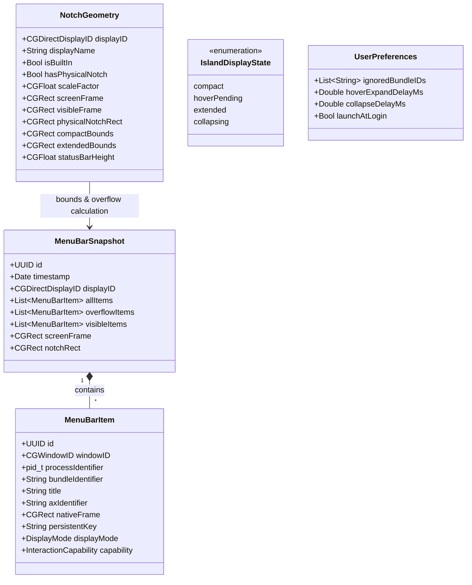
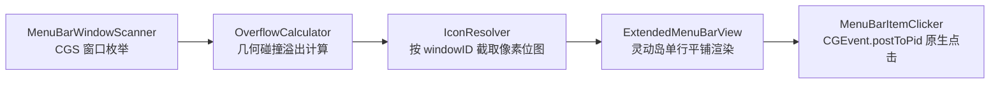
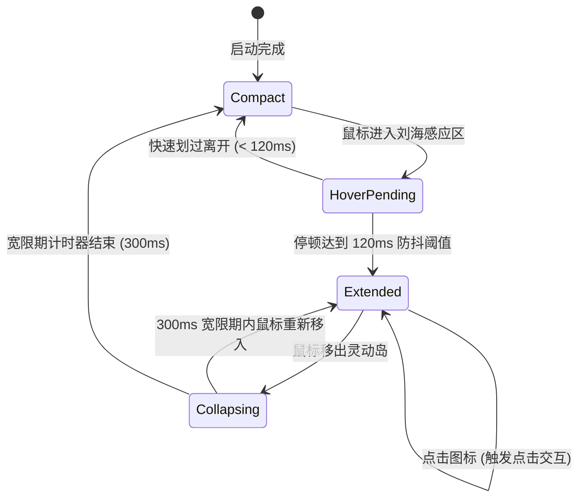

# NotchRail · 领域模型设计规范 (Domain Model Specification - v2 Refined)

本文档根据与架构师审问敲定的**窗口级扩展菜单栏镜像（Window-Level Extended Menu Bar Mirror）**架构，定义 NotchRail 系统的核心领域模型、实体边界、值对象、状态机生命周期与事件驱动机制。

---

## 1. 领域模型全景 (Domain Model Overview)



---

## 2. 核心实体与值对象 (Entities & Value Objects)

### 2.1 菜单栏项 (`MenuBarItem`)
表示扫描识别到的单一菜单栏窗口元素，以 `windowID: CGWindowID` 为底层物理主键。

```swift
public struct MenuBarItem: Identifiable, Equatable, Sendable {
    public let id: UUID
    public let windowID: CGWindowID
    public let processIdentifier: pid_t
    public let bundleIdentifier: String?
    public let title: String?
    public let axIdentifier: String?
    public var nativeFrame: CGRect
    public var displayMode: DisplayMode
    public var capability: InteractionCapability
    public var isUnresponsive: Bool
    
    /// 跨扫描周期的稳定持久化缓存键（基于 Bundle ID、AX 标识符或 Title）
    public var persistentKey: String {
        if let bundleID = bundleIdentifier, !bundleID.isEmpty {
            return "\(bundleID):\(axIdentifier ?? title ?? "default")"
        } else if let axID = axIdentifier, !axID.isEmpty {
            return "ax:\(axID)"
        } else if let t = title, !t.isEmpty {
            return "title:\(t)"
        } else {
            return "win:\(windowID)"
        }
    }
    
    public enum DisplayMode: String, Codable, Sendable {
        case nativeVisible   // 在原生菜单栏清晰可见
        case overflowed      // 因刘海遮挡或右侧空间不足被挤出原生菜单栏
        case ignored         // 用户配置为忽略/隐藏
    }
    
    public enum InteractionCapability: String, Codable, Sendable {
        case directClick     // 支持通过 CGEvent + postToPid 触发原生下拉
        case unsupported     // 系统受限项
    }
}
```

### 2.2 图标解析与降级模型 (`ResolvedIcon`)
```swift
public struct ResolvedIcon: Sendable {
    public let image: NSImage?
    public let sourceType: IconSourceType
    public let sfSymbolName: String?
    public let label: String
    
    public enum IconSourceType: String, Codable, Sendable {
        case windowCapture   // Tier 1: 按 windowID 截取窗口位图（即使被遮挡也能完整提取）
        case appBundleIcon   // Tier 2: 应用 App Bundle 高清图标
        case sfSymbol        // Tier 3: 语义化 SF 符号保底
    }
}
```

### 2.3 菜单栏快照 (`MenuBarSnapshot`)
代表特定显示器上菜单栏扫描后的状态聚合，内置溢出计算结果。

```swift
public struct MenuBarSnapshot: Equatable, Sendable {
    public let id: UUID
    public let timestamp: Date
    public let displayID: CGDirectDisplayID
    public let allItems: [MenuBarItem]
    public let screenFrame: CGRect
    public let notchRect: CGRect
    
    /// 仅展示在灵动岛内的溢出项（原生看不到的项）
    public var overflowItems: [MenuBarItem] {
        allItems.filter { $0.displayMode == .overflowed }
    }
    
    /// 原生仍可见的项（不在岛内重复展示）
    public var visibleItems: [MenuBarItem] {
        allItems.filter { $0.displayMode == .nativeVisible }
    }
}
```

### 2.4 显示与刘海几何描述 (`NotchGeometry`)
```swift
public struct NotchGeometry: Equatable, Sendable {
    public let displayID: CGDirectDisplayID
    public let displayName: String
    public let isBuiltIn: Bool
    public let hasPhysicalNotch: Bool
    public let scaleFactor: CGFloat
    public let screenFrame: CGRect
    public let visibleFrame: CGRect
    public let safeAreaInsets: NSEdgeInsets
    public let physicalNotchRect: CGRect
    public let compactBounds: CGRect         // 胶囊态窗口 Bounds (约 172x36pt)
    public let extendedBounds: CGRect        // 展开态窗口 Bounds (约 720x84pt)
    public let statusBarHeight: CGFloat
}
```

---

## 3. 核心处理管道 (Core Pipeline)



1. **枚举**：`MenuBarWindowScanner` 调用 SkyLight 私有 API `CGSGetProcessMenuBarWindowList` 获取状态栏层级所有窗口及 frame。
2. **计算**：`OverflowCalculator` 对比 `item.nativeFrame.minX < geometry.physicalNotchRect.maxX` 判定受阻项。
3. **渲染**：`IconResolver` 优先调用 `CGWindowListCreateImageFromArray` 提取实时位图，传递给 `IslandIconCell` 单行排布。
4. **交互**：用户点击图标时，`MenuBarItemClicker` 向目标 PID 发送带有目标 `windowID` 的 `CGEvent`，唤出原生菜单。

---

## 4. 状态机设计 (IslandStateMachine)



---

## 5. 领域事件 (Domain Events)

| 事件名称 | 触发时机 | 负载数据 (Payload) | 主要监听者 |
| :--- | :--- | :--- | :--- |
| `MenuBarSnapshotUpdated` | 后台窗口扫描与几何计算完成 | `snapshot: MenuBarSnapshot` | `IslandRootView`, `ExtendedMenuBarView` |
| `ActiveDisplayChanged` | 鼠标跨屏移动至新显示器 | `geometry: NotchGeometry` | `IslandWindowCoordinator`, `ScreenManager` |
| `NotchGeometryChanged` | 显示器插拔或分辨率变化 | `geometry: NotchGeometry` | `IslandWindowCoordinator`, `ScreenManager` |
| `PreferencesChanged` | 用户设置（延迟、忽略名单等）变动 | `preferences: UserPreferences` | `MenuBarSyncCoordinator`, `IslandStateMachine` |
| `PermissionStatusChanged` | 辅助功能或屏幕录制权限授予状态变化 | `isGranted: Bool` | `PermissionWindowCoordinator`, `SettingsView` |
