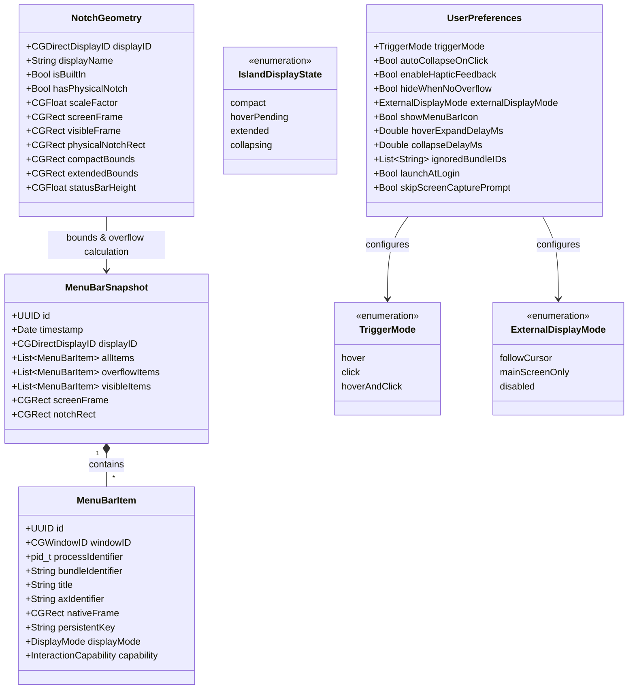
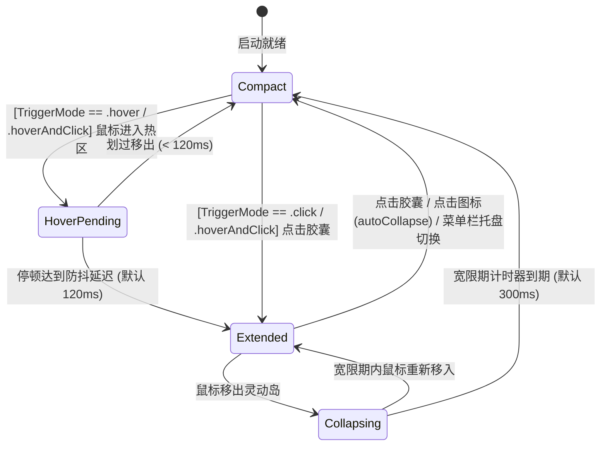

# NotchRail · 领域模型设计规范 (Domain Model Specification - v0.0.3)

本文档定义 NotchRail 系统的核心领域模型、实体边界、值对象、配置体系、状态机生命周期与事件驱动机制。

---

## 1. 领域模型全景 (Domain Model Overview)



---

## 2. 核心实体与值对象 (Entities & Value Objects)

### 2.1 菜单栏项 (`MenuBarItem`)
表示扫描识别到的单一菜单栏窗口元素，以 `windowID: CGWindowID` 为底层物理主键。

```swift
public struct MenuBarItem: Identifiable, Equatable, Sendable {
    public let id: UUID
    public let windowID: CGWindowID
    public let processIdentifier: pid_t
    public let bundleIdentifier: String?
    public let title: String?
    public let axIdentifier: String?
    public var nativeFrame: CGRect
    public var displayMode: DisplayMode
    public var capability: InteractionCapability
    public var isUnresponsive: Bool
    
    /// 跨扫描周期的稳定持久化缓存键（基于 Bundle ID、AX 标识符或 Title）
    public var persistentKey: String {
        if let bundleID = bundleIdentifier, !bundleID.isEmpty {
            return "\(bundleID):\(axIdentifier ?? title ?? "default")"
        } else if let axID = axIdentifier, !axID.isEmpty {
            return "ax:\(axID)"
        } else if let t = title, !t.isEmpty {
            return "title:\(t)"
        } else {
            return "win:\(windowID)"
        }
    }
    
    public enum DisplayMode: String, Codable, Sendable {
        case nativeVisible   // 在原生菜单栏清晰可见
        case overflowed      // 因刘海遮挡或右侧空间不足被挤出原生菜单栏
        case ignored         // 用户配置为忽略/隐藏
    }
    
    public enum InteractionCapability: String, Codable, Sendable {
        case directClick     // 支持通过 CGEvent + postToPid 触发原生下拉
        case unsupported     // 系统受限项
    }
}
```

### 2.2 用户偏好与交互枚举 (`UserPreferences`)

```swift
public enum TriggerMode: String, Codable, CaseIterable, Sendable {
    case hover          // 悬停防抖触发（默认）
    case click          // 仅点击胶囊展开/收起
    case hoverAndClick  // 悬停或点击均可触发
}

public enum ExternalDisplayMode: String, Codable, CaseIterable, Sendable {
    case followCursor   // 随鼠标焦点跨屏迁移（默认）
    case mainScreenOnly // 仅锚定于主显示器/内置刘海屏
    case disabled       // 在外接显示器上完全禁用
}

public struct UserPreferences: Codable, Equatable, Sendable {
    public var triggerMode: TriggerMode
    public var autoCollapseOnClick: Bool
    public var enableHapticFeedback: Bool
    public var hideWhenNoOverflow: Bool
    public var externalDisplayMode: ExternalDisplayMode
    public var showMenuBarIcon: Bool
    public var hoverExpandDelayMs: Double
    public var collapseDelayMs: Double
    public var ignoredBundleIDs: [String]
    public var launchAtLogin: Bool
    public var skipScreenCapturePrompt: Bool
}
```

### 2.3 图标解析模型 (`ResolvedIcon`)
```swift
public struct ResolvedIcon: Sendable {
    public let image: NSImage?
    public let sourceType: IconSourceType
    public let sfSymbolName: String?
    public let label: String
    
    public enum IconSourceType: String, Codable, Sendable {
        case windowCapture   // Tier 1: 按 windowID 截取窗口位图（即使被遮挡也能完整提取）
        case appBundleIcon   // Tier 2: 应用 App Bundle 高清图标
        case sfSymbol        // Tier 3: 语义化 SF 符号保底
    }
}
```

### 2.4 菜单栏快照 (`MenuBarSnapshot`)
代表特定显示器上菜单栏扫描后的状态聚合，内置溢出计算结果。

```swift
public struct MenuBarSnapshot: Equatable, Sendable {
    public let id: UUID
    public let timestamp: Date
    public let displayID: CGDirectDisplayID
    public let allItems: [MenuBarItem]
    public let screenFrame: CGRect
    public let notchRect: CGRect
    
    /// 仅展示在灵动岛内的溢出项（原生看不到的项）
    public var overflowItems: [MenuBarItem] {
        allItems.filter { $0.displayMode == .overflowed }
    }
    
    /// 原生仍可见的项（不在岛内重复展示）
    public var visibleItems: [MenuBarItem] {
        allItems.filter { $0.displayMode == .nativeVisible }
    }
}
```

---

## 3. 状态机驱动多通道触发 (`IslandStateMachine`)



---

## 4. 领域事件广播矩阵 (Domain Events)

| 事件名称 | 触发时机 | 负载数据 (Payload) | 主要监听者 |
| :--- | :--- | :--- | :--- |
| `MenuBarSnapshotUpdated` | 后台窗口扫描与几何计算完成 | `snapshot: MenuBarSnapshot` | `IslandRootView`, `StatusItemManager` |
| `ActiveDisplayChanged` | 鼠标跨屏移动至新显示器 | `geometry: NotchGeometry` | `IslandWindowCoordinator`, `ScreenManager` |
| `NotchGeometryChanged` | 显示器插拔或分辨率变化 | `geometry: NotchGeometry` | `IslandWindowCoordinator`, `ScreenManager` |
| `PreferencesChanged` | 用户设置（打开方式、外接屏模式、延迟、黑名单等）变动 | `preferences: UserPreferences` | `IslandStateMachine`, `IslandWindowCoordinator`, `StatusItemManager` |
| `PermissionStatusChanged` | 辅助功能或屏幕录制权限授予状态变化 | `isGranted: Bool` | `PermissionWindowCoordinator`, `SettingsView` |
