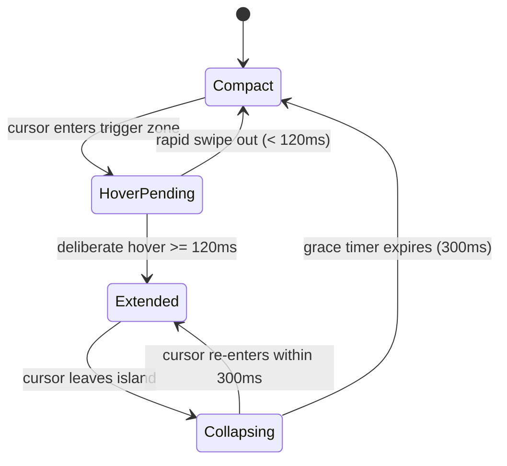

# Specification: NotchRail - Extended Menu Bar for MacBook Notch

## Problem Statement

MacBook models equipped with a camera notch significantly constrain horizontal screen space in the macOS top menu bar. As users install essential status bar utilities (e.g., cloud sync tools, developer clients, communication apps, system monitors), the menu bar runs out of horizontal room to the right of the notch.

When space is exhausted, macOS silently hides or pushes these overflowed menu bar items off-screen. Users cannot see them, click them, or monitor their dynamic status, effectively locking them out of background applications without an intuitive recovery mechanism.

## Solution

NotchRail provides a pure, non-invasive extended menu bar hosted directly beneath the MacBook notch (and rendered with a unified top-adhering notch aesthetic on external or non-notch displays).

Operating strictly as an extended mirror, NotchRail does not tamper with native menu bar items using spacers or force-hide hacks. It enumerates all status bar items via window-level SkyLight APIs and determines which items have overflowed past the notch boundary. When the user moves their cursor over the notch with a deliberate pause (100–150ms), NotchRail smoothly unfolds with spring physics into an Extended Menu Bar displaying exclusively the obscured, overflowed items.

For display and interaction:
1. **Window-Level Screen Capture**: Captures crisp, live pixel images directly by `CGWindowID` using `CGWindowListCreateImageFromArray`, completely bypassing physical notch occlusion.
2. **Direct Event Routing**: Synthesizes native mouse clicks targeted directly at the item's `windowID` and host process (`postToPid`), bringing up the original application menu natively without relying on fragile `AXPress` accessibility actions.

## User Stories

1. As a MacBook user with many status bar utilities, I want NotchRail to automatically identify which menu bar items are hidden by the notch, so that I never lose access to my background tools.
2. As a user, I want the compact pill island to sit neatly inside my MacBook notch without blocking content, so that it feels like an authentic native macOS feature.
3. As a user with an external monitor without a physical notch, I want NotchRail to appear with the exact same top-adhering notch styling at the top of the active display, so that my visual experience is unified across screens.
4. As a user working in a multi-display setup, I want the active island to dynamically migrate to whichever display my mouse cursor is focused on (preserving expansion state if open), so that I don't have to look at another screen to access my menu bar.
5. As a fast typist or UI navigator, I want the island to ignore rapid cursor swipes across the top of the screen (e.g., clicking browser tabs or IDE headers), so that I am not interrupted by accidental expansions.
6. As a user hovering deliberately over the notch for 100~150ms, I want the island to smoothly animate open with a spring physics transition, so that I get immediate and delightful visual feedback.
7. As a user viewing the expanded island, I want to see crisp, real-time pixel-accurate icons of my overflowed apps (captured by `windowID`), so that I can read dynamic badges, text, and statuses even if the native icon is physically behind the notch.
8. As a user clicking an overflowed icon in the island, I want NotchRail to route a native mouse click directly to the target window and PID, so that the application's original menu pops up reliably.
9. As a user clicking an unclickable system item, I want NotchRail to provide a subtle shake animation and haptic feedback without freezing or launching unwanted windows, so that I understand the failure without being disrupted.
10. As a user whose background apps have large numbers of status items, I want NotchRail's scanner to enumerate menu bar windows via atomic SkyLight calls in sub-millisecond time, guaranteeing zero UI hitching.
11. As a user moving my mouse away from the expanded island, I want a 250~350ms collapse grace period, so that small accidental mouse slips don't instantly close the menu.
12. As a user operating across multiple Spaces or in full-screen apps, I want NotchRail's panel to seamlessly join all spaces without drifting or disappearing during Mission Control swipes, so that it remains accessible anywhere.
13. As a user with specific apps I don't need in the island, I want to configure an ignored apps list in Settings, so that my extended menu bar stays clean and relevant.
14. As a user who wants NotchRail available upon boot, I want a toggle to launch NotchRail automatically at login (`SMAppService`), so that I don't have to manually start it after restarting my Mac.
15. As a privacy-conscious user, I want NotchRail to clearly state its two required permissions (Accessibility for click dispatching and Screen Recording for window capture), operating 100% locally without network telemetry.
16. As a user waking my MacBook from sleep or reconnecting monitors, I want NotchRail to automatically recalculate display geometries and refresh the menu bar snapshot, so that the layout is always up to date.
17. As a user whose menu bar apps are closed or newly opened, I want NotchRail to react to system workspace notifications and update the overflow list promptly, so that closed apps disappear and new apps appear.
18. As a user on Retina and non-Retina displays, I want icon captures to automatically scale to the backing scale factor, so that icons look razor-sharp on 2x/3x screens.

## Implementation Decisions

- **Zero-Tampering Extended Mirror Architecture**: NotchRail operates strictly as a mirror and interaction bridge. It does not use `NSStatusItem.length` spacers or private layout manipulation to reorder native status items.
- **Window-Level Enumeration (`MenuBarWindowScanner`)**: Rather than traversing slow and brittle Accessibility (`AXUIElement`) trees, NotchRail enumerates status bar items using SkyLight API (`CGSGetProcessMenuBarWindowList`) filtered by `layer == kCGStatusWindowLevel` (25). This reduces scanning time to < 2ms with zero permission overhead.
- **Three-Tier Icon Pipeline (`IconResolver`)**:
  1. *Tier 1 (Window-Level Real-time Screen Capture)*: Uses `CGWindowListCreateImageFromArray` with the item's `CGWindowID` to capture live pixels (gauges, dynamic numbers, text) even when physically hidden behind the notch.
  2. *Tier 2 (Bundle Icon Fallback)*: Resolves `NSRunningApplication.icon` if window capture is unpermitted or unavailable.
  3. *Tier 3 (SF Symbol + Name Fallback)*: Standardized system glyph and process name fallback if no image can be captured.
- **Geometric Overflow Calculation**: `OverflowCalculator` determines overflow status by calculating item boundaries against the display's notch rectangle (`NotchGeometry`). Items whose horizontal footprint lies to the left of the notch's right edge (`minX < notchBounds.maxX`) are classified as `.overflowed`. Only overflowed items are rendered inside the extended island.
- **Direct Event Routing (`MenuBarItemClicker`)**: Synthesizes `CGEvent` left-clicks configured with `.mouseEventWindowUnderMousePointer` and `eventTargetUnixProcessID`, posting directly via `postToPid(item.ownerPID)`. This provides 100% reliable native menu invocation.
- **Floating Panel Hierarchy**: `IslandPanel` subclasses `NSPanel` configured with:
  - `styleMask: [.borderless, .nonactivatingPanel]`
  - `level: .screenSaver` (floating above regular windows and auxiliary full-screen contexts)
  - `collectionBehavior: [.canJoinAllSpaces, .fullScreenAuxiliary, .stationary, .ignoresCycle]`
  - Transparent `NSHostingView` layer eliminating rectangular clipping artifacts.
- **State Machine Transitions**:

## Required System Permissions

| Permission | Purpose | Mechanism |
| :--- | :--- | :--- |
| **Accessibility** (`AXIsProcessTrusted`) | Synthesizing click events to target window | `CGEvent.postToPid` |
| **Screen Recording** (`CGPreflightScreenCaptureAccess`) | Capturing window live bitmap by `windowID` | `CGWindowListCreateImageFromArray` |

## Out of Scope

- Inserting Spacer items into the native macOS menu bar to force compression or hiding of visible items.
- In-island replication or re-rendering of complex custom drop-down menu UIs (e.g. recreating Bluetooth devices or Sound output menus inside SwiftUI).
- Manual drag-and-drop reordering of third-party native status bar icons.
- Non-macOS operating systems (Windows / Linux).

## Further Notes

- Target deployment: macOS 14.0+ (Sonoma, Sequoia, and beyond).
- Architecture: Dual-target modular structure (`NotchRailKit` core library + `NotchRail` App executable).
- App packaging: Configured with `LSUIElement = true` (Agent mode / Background accessory app without a persistent Dock icon).
